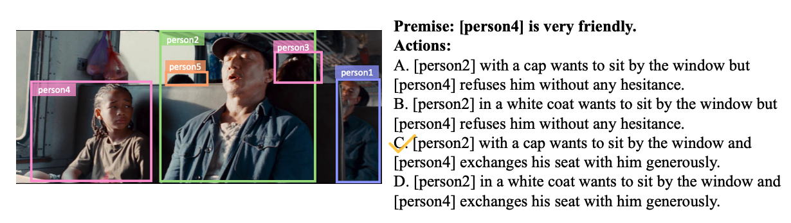

## 一、数据集名称

基于前提假设的跨模态推理评测（Premise-based Multimodal Reasoning, PMR）
## 二、任务概况

基于前提的跨模态推理评测中，每一张图片配有一条文本形式的前提句以及四个可能的选项，模型需要基于前提线索理解图片，再从四个选项中选择唯一符合问题和图片的答案。数据样例如下：



## 三、数据规模

该评测任务包含15,360个人工标注的[前提+图片]-[答案]对，数据的纯文本部分保存在`train.jsonl`、`val.jsonl`和`test.jsonl`三个文件中，其余的图片相关的信息保存在[image.zip](https://drive.google.com/file/d/1saPwU52xEveY2EOiVGL-rxsTyF8OumhS/view)中，可通过链接访问下载。以下是数据集相关的统计信息

|                    |        |        |        |         |
| ------------------ | ------ | ------ | ------ | ------- |
| 统计数据                | 训练集 | 验证集 | 测试集 | 总计    |
| 样本总数           | 12,080 | 1,538  | 1,742  | 15,360  |
| 1-gram 数          | 9,882  | 3,819  | 4,101  | 17,802  |
| 2-gram 数量        | 72,048 | 17,678 | 19,292 | 109,018 |
| 前提文本平均长度   | 9.48   | 9.47   | 9.54   | 28.49   |
| 候选项平均长度     | 14.38  | 14.41  | 14.45  | 43.24   |
| 平均提及的标签个数 | 1.92   | 1.91   | 1.94   | 5.77    |
| 图片数量           | 9,536  | 1,213  | 1,370  | 12,119  |
| 关联电影数量       | 1,353  | 209    | 170    | 1,732   |

## 四、数据格式介绍

```
{
    "total_id": 98,
    
    # 图片源的电影名称
	"movie": "3051_NANNY_MCPHEE_RETURNS",
  
	# 工具提取的图片区域目标列表
	"objects": ["person", "person", "handbag", "spoon"],
  
	# 关联的图片的相对路径
	"img_fn": "lsmdc_3051_NANNY_MCPHEE_RETURNS/3051_NANNY_MCPHEE_RETURNS_01.19.27.912-01.19.30.662@0.jpg",
	
	# 图片的序号
	"img_id": "train-5244",
  
	# 保存检测框信息文件的相对路径
	"metadata_fn": "lsmdc_3051_NANNY_MCPHEE_RETURNS/3051_NANNY_MCPHEE_RETURNS_01.19.27.912-01.19.30.662@0.json",
  
	# 分词后的前提假设文本，列表里的整数代表检测目标在目标列表的索引序号
	"premise": [[1], "and", [0], "are", "in", "good", "relationship", "."],
  
	# 前提假设的类型
	"category": "character"
  
	# 分词后的选项文本，列表里的整数代表检测目标在目标列表的索引序号
	"answer_choices": [
		[[1], "with", "a", "handbag", "will", "hug", [0], "tightly", "."],
		[[1], "with", "a", "green", "handbag", "will", "shout", "at", [0], "in", "the", "kitchen", "."],
		[[1], "with", "a", "handbag", "will", "shout", "at", [0], "in", "the", "kitchen", "."],
		[[1], "with", "a", "green", "handbag", "will", "hug", [0], "tightly", "."]
		],
    
	# 选项文本所对应的答案类型
	"answer_types": ["Action-True", "Distractor2", "Action-False", "Distractor1"],
  
	# 正确答案在选项文本列表中的索引
	"answer_label": 0
	
	# 拥有相同前提假设的另一条数据的全局序号（如果为-1，则代表不存在这样的数据）
	"pal_id":-1
}
```